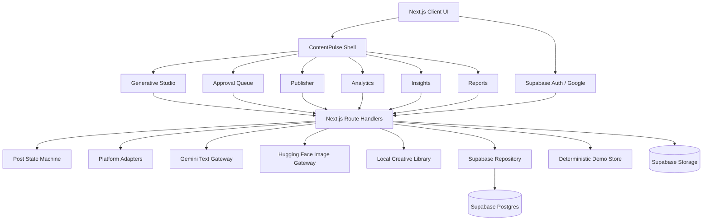

# ContentPulse

ContentPulse is an AI-native content operations command center for Hoichoi-style streaming teams.

It turns a single content brief into platform-specific Bengali and English social posts, routes those posts through human approval, schedules them, validates platform constraints, mock-publishes them with traceable IDs, ingests metrics, generates insights and reports, and turns learnings into the next brief.

> **Create. Approve. Publish. Learn.**

ContentPulse is an internal operations product. It is not a consumer OTT experience, a social network, a video editor, or a real Instagram/YouTube/Facebook integration.

## Product Loop

```text
BRIEF
  |
  v
GENERATE PLATFORM POSTS + VISUALS
  |
  v
HUMAN APPROVAL
  |-------------------+
  |                   |
  v                   v
APPROVE             REJECT / RETRY
  |
  v
SCHEDULE
  |
  v
ADAPTER VALIDATION
  |-------------------+
  |                   |
  v                   v
MOCK PUBLISH       VALIDATION FAILED
  |
  v
METRICS
  |
  v
INSIGHTS + REPORT
  |
  v
NEXT BRIEF
```

## What Is Implemented

### Workspace UI

- Command Center with operational KPIs, workflow flywheel, top concept, latest insight, and activity feed.
- Generative Studio with a structured brief form and native Bengali/English generation labels.
- Wide horizontal generated-content carousel with fixed-width cards, contained scrolling, and scroll snapping.
- Automatic visual generation per generated post with loading, saving, retry, and regenerate states.
- Approval Queue grouped by campaign before platform filters and post review actions.
- Approval post detail view with campaign ID/name, caption, rationale, hashtags, language, and visual.
- Publisher command center with approved, scheduled, published, and validation-failure states.
- Analytics comparison for equivalent concept posts across Instagram, YouTube, and Facebook.
- Insights cards with source post IDs and next-brief actions.
- Weekly reports with evidence citations and Markdown download.

### Authentication and Identity

- Supabase Auth is the identity authority.
- Google is the only login provider.
- No email/password login is implemented.
- No separate application-owned login system is used.
- OAuth callback exchanges the Supabase code for a cookie-backed session.
- Next.js `proxy.ts` refreshes Supabase sessions.
- The shell shows the authenticated Google user's first name and provides logout.

### Google OAuth Configuration

1. Create or select a project in [Google Cloud Console](https://console.cloud.google.com/).
2. Configure the OAuth consent screen as an External application.
3. Add the `openid`, `email`, and `profile` scopes.
4. Add the Google account used for development as a test user.
5. Create a Web application OAuth client.
6. Add this Supabase callback URL as an authorized redirect URI:

```text
https://YOUR_PROJECT_REF.supabase.co/auth/v1/callback
```

7. In Supabase, open **Authentication → Providers → Google**, enable Google, and enter the Google client ID and secret.
8. In **Authentication → URL Configuration**, set the local site URL to `http://localhost:3000` and add `http://localhost:3000/auth/callback` as an allowed redirect URL.
9. Keep the Google client secret in Supabase only. It must never be placed in a `NEXT_PUBLIC_` environment variable or committed to the repository.

### AI and Media

#### Text AI

Gemini handles:

- Campaign concept generation.
- Platform-specific post copy.
- Native Bengali generation directly from the brief.
- Retry generation from human feedback.
- Performance insights.
- Weekly reports.
- Insight-to-next-brief conversion.

Text model routing supports environment overrides, fallback models, and retries for transient `503`/`429` capacity errors.

#### Visuals

The active visual pipeline is:

```text
Hugging Face text-to-image
          |
          | unavailable or no token
          v
Local platform creative library
          |
          v
Supabase Storage
          |
          v
posts.creative_url
```

Gemini and OpenAI are not used by the active image-generation routes.

The local fallback assets are mapped by platform:

- Instagram: vertical visual treatment.
- YouTube: wide cinematic visual treatment.
- Facebook: square social visual treatment.

Visual generation is deliberately split from persistence:

1. `POST /api/creative/generate` returns an image data URL immediately.
2. The frontend displays the result.
3. `POST /api/creative` uploads it to Supabase Storage.
4. The post's `creative_url` is persisted.

This means a Storage failure does not hide a successfully generated visual.

### Persistence

When all of the following are true:

- `NEXT_PUBLIC_DEMO_MODE=false`.
- Supabase environment variables are configured.
- The user has an authenticated Supabase session.
- The schema has been applied.

ContentPulse persists campaigns, concepts, posts, metrics, insights, reports, and creative URLs through `utils/contentpulse/repository.ts`.

The in-memory store remains the deterministic fallback for demo mode and unavailable persistence.

#### Deferred Campaign Persistence

Studio generation is intentionally ephemeral. Creating a campaign and generating posts does not immediately persist the campaign workflow.

Persistence occurs when the user clicks **Proceed to Approval Queue**:

```text
Studio generation
      |
      v
Ephemeral campaign/concept/posts
      |
      v
POST /api/campaigns/[id]/commit
      |
      v
Supabase campaign + concept + posts
```

This prevents abandoned generation attempts and unrelated historical posts from appearing in the current Studio session.

### State Machine

The server-side transition boundary is:

```text
draft       -> generating
generating  -> review
review      -> rejected | approved
rejected    -> generating
approved    -> scheduled
scheduled   -> published
published   -> terminal
```

Invalid transitions are rejected server-side. For example:

- `review -> scheduled` is invalid.
- `review -> published` is invalid.
- `rejected -> published` is invalid.
- `draft -> published` is invalid.

### Platform Adapters

Adapters are deterministic mock adapters. They do not call social APIs or OAuth providers.

| Platform  | Primary ratio | Allowed ratios       | Adapter behavior                                   |
| --------- | ------------- | -------------------- | -------------------------------------------------- |
| Instagram | `9:16`        | `9:16`, `4:5`, `1:1` | Validates aspect ratio and returns stable mock IDs |
| YouTube   | `16:9`        | `16:9`, `9:16`       | Validates aspect ratio and returns stable mock IDs |
| Facebook  | `1:1`         | `1:1`, `4:5`, `16:9` | Validates aspect ratio and returns stable mock IDs |

Invalid assets are rejected. Content is never silently cropped or resized.

## Publisher Flow

The Publisher makes this workflow visible:

```text
APPROVED
   |
   v
SCHEDULED
   |
   v
VALIDATE
   |
   v
MOCK PUBLISH
   |
   v
PUBLISHED
```

Publisher behavior:

- Approved posts expose **Schedule Post**.
- Scheduling uses `POST /api/posts/[id]/schedule`.
- Scheduled posts expose **Publish Now**.
- Publishing uses `POST /api/posts/[id]/publish`.
- The adapter validates the post before publishing.
- Successful mock publication returns stable traceable IDs such as `IG_001`, `YT_001`, and `FB_001`.
- Invalid ratio demonstrations remain visible as validation failures and cannot become published.

## System Architecture



## Data Model

The main relational entities are:

```text
Campaign
  └── CampaignConcept
        └── GeneratedPost
              └── PostMetrics

Campaign
  ├── Insight
  └── WeeklyReport
```

Core tables in `supabase/schema.sql`:

- `campaigns`
- `campaign_concepts`
- `posts`
- `post_metrics`
- `insights`
- `reports`

The existing Problem 1 tables remain intact:

- `projects`
- `analyses`
- `chat_messages`

Campaigns and reports include owner IDs. Child records are scoped through campaign ownership in the RLS policies.

## API Routes

### Campaigns

| Method | Route                        | Purpose                                                   |
| ------ | ---------------------------- | --------------------------------------------------------- |
| `GET`  | `/api/campaigns`             | List campaigns from Supabase or fallback store            |
| `POST` | `/api/campaigns`             | Create an ephemeral campaign brief                        |
| `GET`  | `/api/campaigns/[id]`        | Read a campaign with related concept/posts                |
| `POST` | `/api/campaigns/[id]/commit` | Persist current campaign, concept, and posts for Approval |

### Generation and Briefs

| Method | Route                      | Purpose                             |
| ------ | -------------------------- | ----------------------------------- |
| `POST` | `/api/generate`            | Generate concept and platform posts |
| `POST` | `/api/briefs/from-insight` | Create a next brief from an insight |

### Visuals

| Method | Route                    | Purpose                                          |
| ------ | ------------------------ | ------------------------------------------------ |
| `POST` | `/api/creative/generate` | Generate HF or local-fallback image data URL     |
| `POST` | `/api/creative`          | Upload creative and persist `posts.creative_url` |

### Post Workflow

| Method | Route                      | Purpose                               |
| ------ | -------------------------- | ------------------------------------- |
| `GET`  | `/api/posts`               | Filterable post reads                 |
| `POST` | `/api/posts/[id]/approve`  | `review -> approved`                  |
| `POST` | `/api/posts/[id]/reject`   | `review -> rejected`                  |
| `POST` | `/api/posts/[id]/retry`    | `rejected -> generating -> review`    |
| `POST` | `/api/posts/[id]/schedule` | `approved -> scheduled`               |
| `POST` | `/api/posts/[id]/publish`  | Validate and `scheduled -> published` |

### Metrics, Insights, and Reports

| Method | Route                    | Purpose                        |
| ------ | ------------------------ | ------------------------------ |
| `GET`  | `/api/metrics`           | Read metrics                   |
| `GET`  | `/api/metrics/[postId]`  | Read metrics for one post      |
| `POST` | `/api/metrics/ingest`    | Ingest deterministic metrics   |
| `GET`  | `/api/insights`          | Read insights                  |
| `POST` | `/api/insights/generate` | Generate insights from metrics |
| `GET`  | `/api/reports`           | Read reports                   |
| `POST` | `/api/reports/generate`  | Generate a weekly report       |

## Environment Variables

Copy the example file:

```bash
cp .env.example .env
```

Required for authenticated persistence:

```env
NEXT_PUBLIC_SUPABASE_URL=https://YOUR_PROJECT_REF.supabase.co
NEXT_PUBLIC_SUPABASE_PUBLISHABLE_KEY=YOUR_SUPABASE_PUBLISHABLE_KEY
NEXT_PUBLIC_DEMO_MODE=false
```

Required for text AI:

```env
GEMINI_API_KEY=YOUR_GEMINI_API_KEY
GEMINI_REASONING_MODEL=gemini-3.5-flash
GEMINI_FAST_MODEL=gemini-3.5-flash-lite
GEMINI_MODEL=gemini-3.5-flash-lite
```

Optional remote visual generation:

```env
HF_API_KEY=YOUR_HUGGINGFACE_TOKEN
HF_IMAGE_MODEL=black-forest-labs/FLUX.1-schnell
```

Storage and upload settings:

```env
SUPABASE_STORAGE_BUCKET=contentpulse-media
MAX_UPLOAD_MB=100
CONTENTPULSE_DEMO_MODE=false
```

Never commit real API keys. `NEXT_PUBLIC_` values are browser-visible; server secrets such as `GEMINI_API_KEY` and `HF_API_KEY` must not use that prefix.

## Supabase Setup

1. Create or select a Supabase project.
2. Configure Google under **Authentication → Providers → Google**.
3. Configure Google OAuth using the Google OAuth Configuration steps above.
4. Apply [supabase/schema.sql](supabase/schema.sql) in the Supabase SQL Editor.
5. Confirm the `contentpulse-media` bucket exists under Storage.
6. Confirm the owner-aware policies and Storage policies were applied.
7. Sign in with Google.
8. Set `NEXT_PUBLIC_DEMO_MODE=false`.
9. Restart the Next.js server after environment changes.

The schema is designed to be rerunnable: existing policies are dropped before recreation, owner comparisons use compatible text casts, and the Storage bucket uses an upsert-style insert.

## Local Development

```bash
npm install
cp .env.example .env
npm run dev
```

Open:

- `http://localhost:3000/login` for Google login.
- `http://localhost:3000/` for Command Center.
- `http://localhost:3000/studio` for generation.
- `http://localhost:3000/approval` for human review.
- `http://localhost:3000/publisher` for scheduling and mock publishing.
- `http://localhost:3000/analytics` for platform comparison.
- `http://localhost:3000/insights` for AI insights.
- `http://localhost:3000/reports` for weekly reports.

## Recommended Demo Walkthrough

1. Sign in with Google.
2. Open Generative Studio.
3. Fill the brief and select platforms.
4. Generate platform-specific copy.
5. Wait for visual cards to complete or use local fallback assets.
6. Review the horizontal generated-post carousel.
7. Click **Proceed to Approval Queue**.
8. Select the committed campaign.
9. Approve or reject posts.
10. Open Publisher.
11. Schedule an approved post.
12. Publish it through deterministic adapter validation and mock publishing.
13. Show the stable external post ID.
14. Ingest metrics.
15. Generate insights.
16. Generate and download the weekly report.
17. Create the next brief from an insight.

## Validation Commands

```bash
npm run lint
npm run build
npx tsc --noEmit
```

The current implementation has passed TypeScript and production-build validation during development. Browser-level end-to-end tests are still a remaining hardening task.

## Current Known Gaps

- Hugging Face image generation and the local fallback need a final live verification with the configured token/model.
- Supabase Storage and `posts.creative_url` should be rechecked after a fresh visual generation and browser refresh.
- Cross-user ownership and RLS behavior need positive and negative tests with two accounts.
- **Storage URL privacy shortcut:** For the hackathon demo, creative assets use public Supabase Storage URLs and paths are campaign-scoped to keep the walkthrough simple and save setup time. In a production deployment, use a private bucket, user-scoped object paths, and short-lived signed URLs so one user cannot access another user’s campaign files.
- Browser walkthrough tests are not yet committed.
- The repository still has deterministic fixtures for fallback and some non-demo screens while the authenticated read path is being fully verified.
- Monitoring and structured timeout/error reporting for external AI and Storage providers remain future hardening work.
