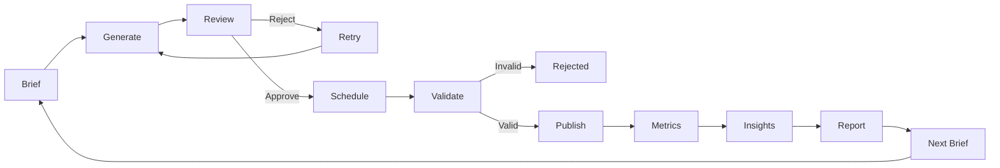
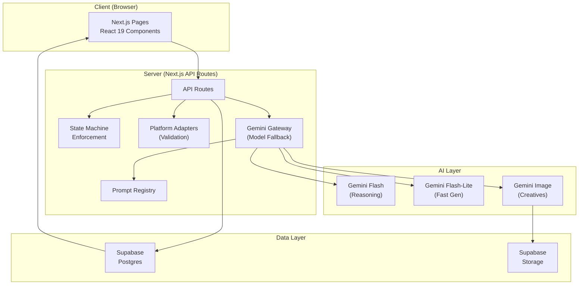
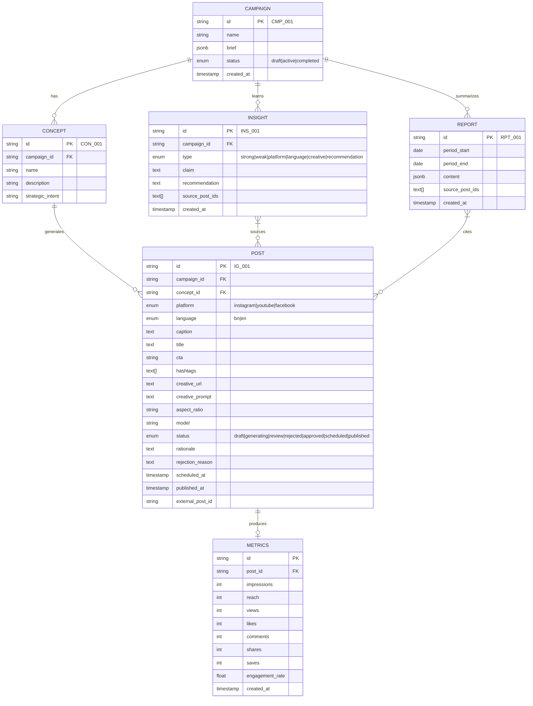
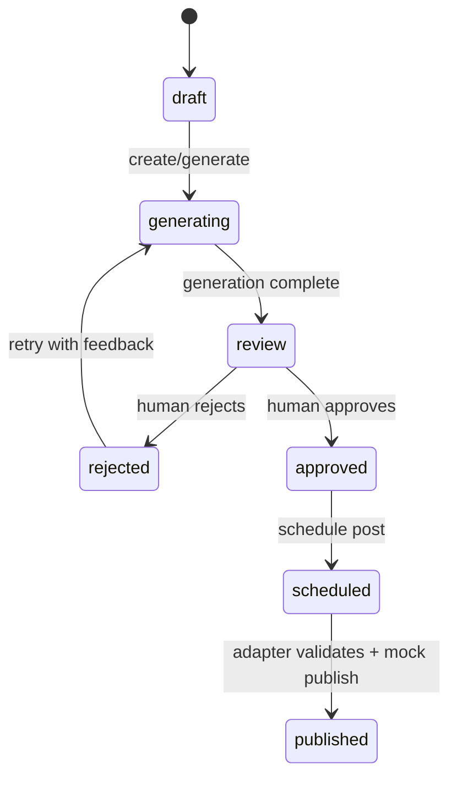
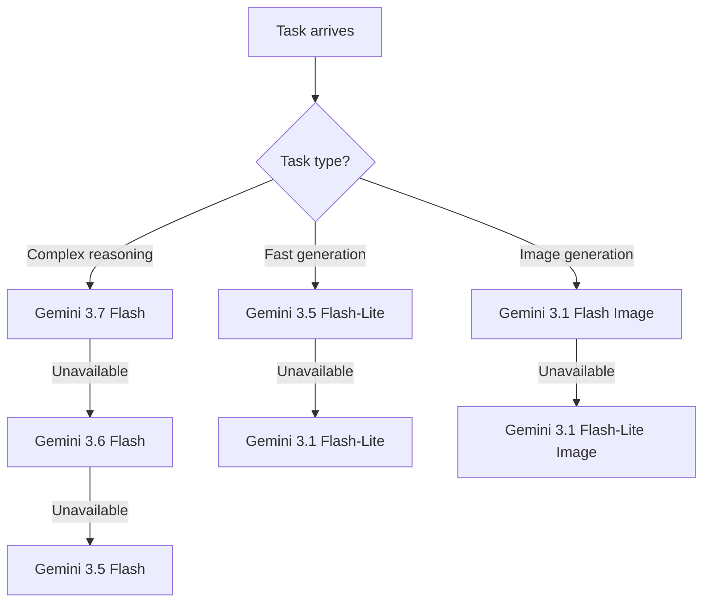
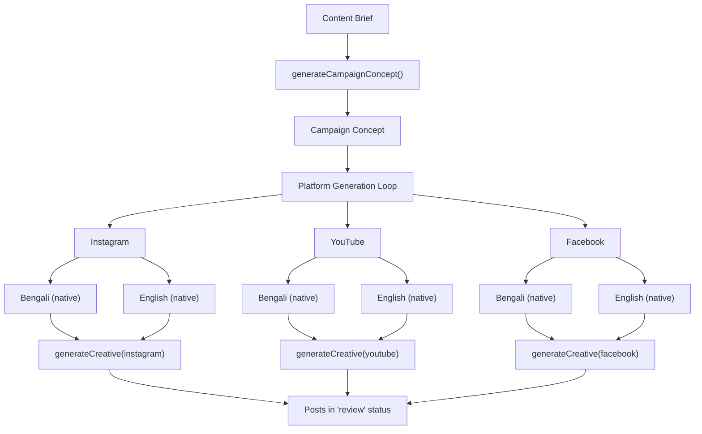
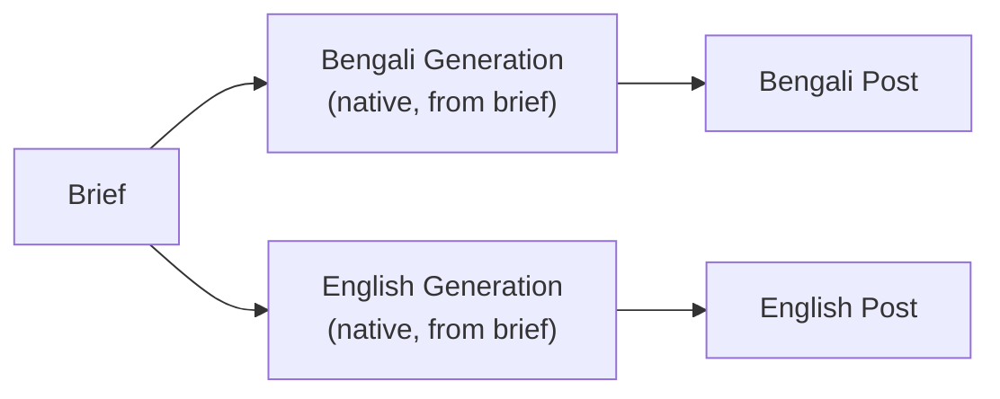
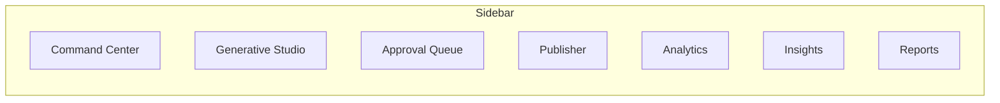

# ContentPulse — Complete System Design

> **Create. Approve. Publish. Learn.**
>
> AI-native content operations command center for Hoichoi

---

## 1. Executive Summary

ContentPulse is a closed-loop AI content operations platform that takes one marketing brief, generates platform-specific Bengali and English creatives, routes them through human approval, validates and mock-publishes them, collects performance metrics, generates AI-powered insights, and converts those learnings into the next campaign brief.

> [!IMPORTANT]
> This is a **hackathon MVP** — the design optimizes for a reliable end-to-end demo loop, not production-scale architecture.

### The Core Loop



---

## 2. Existing Scaffold — What We Have

### Tech Stack (Keep)
| Layer | Technology | Version |
|-------|-----------|---------|
| Framework | Next.js | 16.3.6 |
| UI | React | 19.2.8 |
| Language | TypeScript | 5.x |
| Styling | Tailwind CSS | 4.x |
| Database | Supabase (Postgres) | SSR client |
| AI | Gemini via `@google/genai` | 2.24.0 |
| Validation | Zod | 4.6.5 |

### Existing Code (Reuse/Evolve)
| File | Current Purpose | Action for Problem 3 |
|------|----------------|---------------------|
| `app/layout.tsx` | Root layout with Geist fonts | **Keep** — update metadata |
| `app/page.tsx` | Video analysis dashboard (Problem 1) | **Replace content** — becomes Command Center |
| `app/globals.css` | Light-mode video dashboard styles | **Evolve** — convert to dark mode, add new component styles |
| `app/api/analyze/route.ts` | Video upload + Gemini analysis | **Keep as reference** — Gemini SDK patterns reusable |
| `utils/contentpulse/types.ts` | `EpisodeAnalysis` types | **Replace** — new Problem 3 domain types |
| `utils/contentpulse/demo-data.ts` | Video episode fixture | **Replace** — new campaign/post demo data |
| `utils/contentpulse/analysis-schema.ts` | Zod schema for video analysis | **Keep alongside** — new schemas for post generation |
| `utils/supabase/server.ts` | Server-side Supabase client | **Keep as-is** |
| `utils/supabase/client.ts` | Browser Supabase client | **Keep as-is** |
| `supabase/schema.sql` | `projects`, `analyses`, `chat_messages` | **Extend** — add Problem 3 tables |
| `public/HoiChoi Logo.png` | Logo | **Keep** |

---

## 3. System Architecture



### Key Architectural Decisions

| Decision | Choice | Rationale |
|----------|--------|-----------|
| Rendering | Server Components + Client Components | Next.js 16 default; forms/interactions as client |
| AI calls | Server-side only (API routes) | Never expose API keys to browser |
| State management | Supabase + server actions | No Redux/Zustand needed for MVP |
| Image storage | Supabase Storage | Already configured bucket |
| Model routing | Server-side registry with fallback chain | Demo reliability > model prestige |
| Platform validation | Deterministic adapters (no real social APIs) | Hackathon scope |

---

## 4. Domain Model

### 4.1 Type Definitions



### 4.2 TypeScript Types

```typescript
type Platform = "instagram" | "youtube" | "facebook"
type Language = "bn" | "en"
type PostStatus = "draft" | "generating" | "review" | "rejected" | "approved" | "scheduled" | "published"

type ContentBrief = {
  id: string
  campaignName: string
  objective: string
  topic: string
  audience: string
  primaryLanguage: Language
  secondaryLanguage?: Language
  tone: string
  cta: string
  platforms: Platform[]
  context?: string
}

type Campaign = {
  id: string
  name: string
  brief: ContentBrief
  status: "draft" | "active" | "completed"
  createdAt: string
}

type CampaignConcept = {
  id: string
  campaignId: string
  name: string
  description: string
  strategicIntent: string
}

type GeneratedPost = {
  id: string
  campaignId: string
  conceptId: string
  platform: Platform
  language: Language
  caption: string
  title?: string
  cta: string
  hashtags: string[]
  creativePrompt: string
  creativeUrl?: string
  aspectRatio: string
  rationale: string
  model?: string
  status: PostStatus
  rejectionReason?: string
  scheduledAt?: string
  publishedAt?: string
  externalPostId?: string
}

type PostMetrics = {
  id: string
  postId: string
  impressions: number
  reach?: number
  views?: number
  likes: number
  comments: number
  shares: number
  saves?: number
  engagementRate: number
  createdAt: string
}

type Insight = {
  id: string
  campaignId: string
  type: "strong" | "weak" | "platform" | "language" | "creative" | "recommendation"
  claim: string
  recommendation: string
  sourcePostIds: string[]
  createdAt: string
}

type WeeklyReport = {
  id: string
  periodStart: string
  periodEnd: string
  content: {
    executiveSummary: string
    whatWorked: string[]
    whatUnderperformed: string[]
    platformLearnings: string[]
    languageLearnings: string[]
    creativeLearnings: string[]
    recommendedNextActions: string[]
  }
  sourcePostIds: string[]
  createdAt: string
}
```

---

## 5. Post Status State Machine

> [!CAUTION]
> The state machine is a **security boundary**. Both server AND client must enforce it.



### Valid Transitions (enforced server-side)

| From | To | Trigger |
|------|----|---------|
| `draft` | `generating` | User clicks "Generate Campaign" |
| `generating` | `review` | AI generation completes |
| `review` | `rejected` | User clicks "Reject & Retry" |
| `review` | `approved` | User clicks "Approve" |
| `rejected` | `generating` | User submits retry feedback |
| `approved` | `scheduled` | User clicks "Schedule" |
| `scheduled` | `published` | Adapter validates + mock publish succeeds |

### Invalid Transitions (must be rejected)

| Attempt | Result |
|---------|--------|
| `review` → `scheduled` | ❌ Blocked: "Post requires approval" |
| `review` → `published` | ❌ Blocked |
| `draft` → `published` | ❌ Blocked |
| `rejected` → `published` | ❌ Blocked |
| `rejected` → `scheduled` | ❌ Blocked |

---

## 6. Platform Adapters

### 6.1 Platform Profiles

| Property | Instagram | YouTube | Facebook |
|----------|-----------|---------|----------|
| **Primary Ratio** | 9:16 | 16:9 | 1:1 or 4:5 |
| **Allowed Ratios** | `["9:16", "4:5", "1:1"]` | `["16:9", "9:16"]` | `["1:1", "4:5", "16:9"]` |
| **Max Caption** | 2200 chars | 5000 chars | 63206 chars |
| **Tone** | Energetic, intimate | Explanatory, cinematic | Conversational |
| **Hashtag Style** | Limited (5-10) | Minimal (3-5) | Moderate (5-15) |
| **CTA Style** | Direct ("Watch now") | Watch / Subscribe | Watch / Learn more / Share |
| **Creative Emphasis** | Character + visual hook | Wide cinematic composition | Social/share-friendly |

### 6.2 Adapter Validation Logic

```typescript
interface AdapterValidationResult {
  valid: boolean
  errors: Array<{
    field: string
    code: string
    message: string
  }>
}

// Example: InstagramAdapter.validate(post) → rejects 16:9
```

### 6.3 Mock Publishing

```typescript
// Returns stable, traceable IDs
interface PublishResult {
  success: boolean
  externalPostId: string  // "IG_001", "YT_001", "FB_001"
  publishedAt: string
}
```

> [!WARNING]
> Adapters must **reject** invalid assets. No silent resizing/cropping.

---

## 7. AI Pipeline

### 7.1 Model Registry & Fallback Strategy



### 7.2 Task → Model Routing

| Function | Model Tier | Purpose |
|----------|-----------|---------|
| `generateCampaignConcept()` | Reasoning | Creative strategic thinking |
| `generatePlatformPost()` | Fast | High-volume post generation |
| `generateBengaliPost()` | Reasoning | Native Bengali quality |
| `retryPost()` | Fast | Quick regeneration |
| `reviewBengali()` | Fast | Editorial quality check |
| `generateInsights()` | Reasoning | Performance analysis |
| `generateWeeklyReport()` | Fast | Structured report synthesis |
| `generateNextBrief()` | Fast | Recommendation → brief conversion |
| `generateCreative()` | Image | Visual asset generation |

### 7.3 Generation Pipeline



### 7.4 Prompt Architecture

```text
utils/contentpulse/prompts/
  ├── campaign.ts          # Campaign concept generation
  ├── instagram.ts         # Instagram-specific post prompt
  ├── youtube.ts           # YouTube-specific post prompt
  ├── facebook.ts          # Facebook-specific post prompt
  ├── retry.ts             # Post retry with feedback
  ├── bengali-review.ts    # Bengali editorial review (optional)
  ├── insights.ts          # Performance insight generation
  ├── report.ts            # Weekly report synthesis
  └── next-brief.ts        # Insight → brief conversion
```

Each prompt receives:

```text
BRIEF + CAMPAIGN CONCEPT + PLATFORM PROFILE + LANGUAGE + BRAND CONTEXT + RETRY FEEDBACK
```

And must produce structured JSON:

```json
{
  "platform": "instagram",
  "language": "bn",
  "caption": "...",
  "cta": "এখনই দেখুন",
  "hashtags": ["#Hoichoi", "#BengaliDrama"],
  "title": "...",
  "creativePrompt": "...",
  "aspectRatio": "9:16",
  "rationale": "Character-first emotional hook for vertical feed."
}
```

### 7.5 Native Bengali Generation

> [!IMPORTANT]
> Bengali content is generated **directly from the brief** in Bengali, NOT translated from English.



UI must display: **"Bengali — Native generation"**

### 7.6 Brand Context

```typescript
const brandContext = {
  brand: "hoichoi",
  style: "bold, cinematic, culturally relevant, entertainment-first",
  avoid: [
    "generic corporate language",
    "empty marketing buzzwords",
    "overloaded hashtags"
  ]
}
```

---

## 8. Database Schema

### 8.1 New Tables (extend existing schema)

```sql
-- Campaigns
CREATE TABLE IF NOT EXISTS public.campaigns (
  id text PRIMARY KEY,                    -- CMP_001 format
  name text NOT NULL,
  brief jsonb NOT NULL,
  status text NOT NULL DEFAULT 'draft'
    CHECK (status IN ('draft', 'active', 'completed')),
  created_at timestamptz NOT NULL DEFAULT now()
);

-- Campaign concepts
CREATE TABLE IF NOT EXISTS public.campaign_concepts (
  id text PRIMARY KEY,                    -- CON_001 format
  campaign_id text NOT NULL REFERENCES public.campaigns(id),
  concept_name text NOT NULL,
  concept_description text NOT NULL,
  strategic_intent text NOT NULL,
  created_at timestamptz NOT NULL DEFAULT now()
);

-- Generated posts
CREATE TABLE IF NOT EXISTS public.posts (
  id text PRIMARY KEY,                    -- IG_001, YT_001, FB_001 format
  campaign_id text NOT NULL REFERENCES public.campaigns(id),
  concept_id text NOT NULL REFERENCES public.campaign_concepts(id),
  platform text NOT NULL CHECK (platform IN ('instagram', 'youtube', 'facebook')),
  language text NOT NULL CHECK (language IN ('bn', 'en')),
  caption text NOT NULL,
  title text,
  cta text NOT NULL,
  hashtags text[] NOT NULL DEFAULT '{}',
  creative_url text,
  creative_prompt text,
  aspect_ratio text NOT NULL,
  model text,
  rationale text,
  rejection_reason text,
  status text NOT NULL DEFAULT 'draft'
    CHECK (status IN ('draft','generating','review','rejected','approved','scheduled','published')),
  external_post_id text,
  scheduled_at timestamptz,
  published_at timestamptz,
  created_at timestamptz NOT NULL DEFAULT now()
);

-- Post metrics
CREATE TABLE IF NOT EXISTS public.post_metrics (
  id text PRIMARY KEY,
  post_id text NOT NULL REFERENCES public.posts(id),
  impressions integer NOT NULL DEFAULT 0,
  reach integer,
  views integer,
  likes integer NOT NULL DEFAULT 0,
  comments integer NOT NULL DEFAULT 0,
  shares integer NOT NULL DEFAULT 0,
  saves integer,
  engagement_rate numeric(5,4) NOT NULL DEFAULT 0,
  created_at timestamptz NOT NULL DEFAULT now()
);

-- AI insights
CREATE TABLE IF NOT EXISTS public.insights (
  id text PRIMARY KEY,                    -- INS_001 format
  campaign_id text NOT NULL REFERENCES public.campaigns(id),
  type text NOT NULL CHECK (type IN ('strong','weak','platform','language','creative','recommendation')),
  claim text NOT NULL,
  recommendation text NOT NULL,
  source_post_ids text[] NOT NULL DEFAULT '{}',
  created_at timestamptz NOT NULL DEFAULT now()
);

-- Weekly reports
CREATE TABLE IF NOT EXISTS public.reports (
  id text PRIMARY KEY,                    -- RPT_001 format
  period_start date NOT NULL,
  period_end date NOT NULL,
  content jsonb NOT NULL,
  source_post_ids text[] NOT NULL DEFAULT '{}',
  created_at timestamptz NOT NULL DEFAULT now()
);

-- Indexes
CREATE INDEX IF NOT EXISTS posts_campaign_id_idx ON public.posts(campaign_id);
CREATE INDEX IF NOT EXISTS posts_concept_id_idx ON public.posts(concept_id);
CREATE INDEX IF NOT EXISTS posts_status_idx ON public.posts(status);
CREATE INDEX IF NOT EXISTS post_metrics_post_id_idx ON public.post_metrics(post_id);
CREATE INDEX IF NOT EXISTS insights_campaign_id_idx ON public.insights(campaign_id);

-- RLS (demo-permissive)
ALTER TABLE public.campaigns ENABLE ROW LEVEL SECURITY;
ALTER TABLE public.campaign_concepts ENABLE ROW LEVEL SECURITY;
ALTER TABLE public.posts ENABLE ROW LEVEL SECURITY;
ALTER TABLE public.post_metrics ENABLE ROW LEVEL SECURITY;
ALTER TABLE public.insights ENABLE ROW LEVEL SECURITY;
ALTER TABLE public.reports ENABLE ROW LEVEL SECURITY;
```

### 8.2 Relationship to Existing Tables

The old `projects`, `analyses`, `chat_messages` tables remain untouched. They serve the Problem 1 video-analysis feature and can coexist.

---

## 9. API Surface

### 9.1 Route Map

| Method | Route | Purpose |
|--------|-------|---------|
| `POST` | `/api/campaigns` | Create campaign from brief |
| `POST` | `/api/generate` | Generate campaign concept + platform posts |
| `POST` | `/api/posts/[id]/retry` | Retry rejected post with feedback |
| `POST` | `/api/posts/[id]/approve` | Approve post (review → approved) |
| `POST` | `/api/posts/[id]/schedule` | Schedule post (approved → scheduled) |
| `POST` | `/api/posts/[id]/publish` | Validate + mock publish (scheduled → published) |
| `POST` | `/api/metrics/ingest` | Ingest deterministic demo metrics |
| `POST` | `/api/insights/generate` | Generate AI insights from metrics |
| `POST` | `/api/reports/generate` | Generate weekly report |
| `POST` | `/api/briefs/from-insight` | Convert insight → editable brief |
| `GET` | `/api/campaigns` | List all campaigns |
| `GET` | `/api/campaigns/[id]` | Get campaign with posts |
| `GET` | `/api/posts` | List posts (filterable by status, platform) |
| `GET` | `/api/metrics/[postId]` | Get metrics for a post |
| `GET` | `/api/insights` | List insights |
| `GET` | `/api/reports` | List reports |

### 9.2 State Transition API Safety

Every mutation endpoint MUST verify the current status before transitioning:

```typescript
// Server-side enforcement example
async function approvePost(postId: string) {
  const post = await getPost(postId)
  if (post.status !== "review") {
    throw new Error(`Cannot approve: post is in '${post.status}' state`)
  }
  return updatePostStatus(postId, "approved")
}
```

---

## 10. UI / Information Architecture

### 10.1 Navigation Structure



### 10.2 Page-by-Page Design

#### A. Command Center (`/`)
**Purpose**: Operational overview — entry point

**Content**:
- Stats row: Active Campaigns, Awaiting Approval, Scheduled, Published
- Visual pipeline loop: Brief → Generate → Approve → Publish → Measure → Learn → Next Brief
- Top Performing Concept card
- Latest AI Insight card with "Create Next Brief →" CTA
- Recent Activity feed

#### B. Generative Studio (`/studio`)
**Purpose**: Create campaigns from a brief

**Two sub-views**:
1. **Brief Form**: Campaign fields → "Generate Campaign ✦" button
2. **Results View**: 3-column platform cards showing generated posts with approve/reject actions

#### C. Approval Queue (`/approval`)
**Purpose**: Human-in-the-loop gate

**Content**:
- Filter tabs: All | Instagram | YouTube | Facebook
- Post cards with status badges, validation results, approve/reject actions
- Rejected posts show feedback + retry button

#### D. Publisher (`/publisher`)
**Purpose**: Publishing pipeline view

**Columns/Kanban**:
- Draft/Review → Approved → Scheduled → Published | Rejected
- Each card shows adapter validation status
- Invalid posts show rejection reason with red error

#### E. Analytics (`/analytics`)
**Purpose**: Performance data + like-for-like comparison

**Content**:
- Campaign selector
- Concept grouping showing side-by-side platform metrics
- Post ID traceability (IG_001, YT_001, FB_001)

#### F. Insights (`/insights`)
**Purpose**: AI-generated performance insights

**Content**:
- Insight cards with claim, recommendation, source post IDs
- "Create Next Brief →" button on each insight

#### G. Reports (`/reports`)
**Purpose**: Weekly report synthesis

**Content**:
- Report sections: Summary, What Worked, What Changed, Platform/Language/Creative Learnings, Recommendations
- Source post IDs cited
- "Create Next Brief →" CTA

### 10.3 Stitch UI Project

All screens have been designed in **Stitch project `16872147240321008888`** ("ContentPulse — AI Content Operations") with the `ContentPulse Dark` design system:
- Dark mode (#0a0a0a background)
- Hoichoi red (#ef4444) primary
- AI blue (#3b82f6) secondary
- Amber (#f59e0b) for warnings
- Inter headings / JetBrains Mono for labels/IDs

Screens generated:
1. **Command Center** — Main dashboard with stats, pipeline, insights
2. **Generative Studio (Brief Form)** — Campaign brief input
3. **Generation Results** — 3-column platform-specific outputs
4. **Approval Queue** — Post review with status badges
5. **Publisher** — Publishing pipeline with adapter validation
6. **Analytics** — Like-for-like comparison view
7. **Insights + Reports** — AI insights with source traceability

---

## 11. File Structure (Proposed)

```text
content-pulse/
├── app/
│   ├── layout.tsx                          # Root layout (keep, update metadata)
│   ├── page.tsx                            # Command Center
│   ├── globals.css                         # Dark mode styles
│   ├── studio/
│   │   └── page.tsx                        # Generative Studio
│   ├── approval/
│   │   └── page.tsx                        # Approval Queue
│   ├── publisher/
│   │   └── page.tsx                        # Publisher
│   ├── analytics/
│   │   └── page.tsx                        # Analytics + Comparison
│   ├── insights/
│   │   └── page.tsx                        # AI Insights
│   ├── reports/
│   │   └── page.tsx                        # Weekly Reports
│   └── api/
│       ├── analyze/route.ts                # (keep) Old video analysis
│       ├── campaigns/
│       │   └── route.ts                    # GET/POST campaigns
│       ├── generate/
│       │   └── route.ts                    # POST generate campaign
│       ├── posts/
│       │   └── [id]/
│       │       ├── retry/route.ts
│       │       ├── approve/route.ts
│       │       ├── schedule/route.ts
│       │       └── publish/route.ts
│       ├── metrics/
│       │   ├── route.ts                    # GET metrics
│       │   └── ingest/route.ts             # POST demo metrics
│       ├── insights/
│       │   └── generate/route.ts
│       ├── reports/
│       │   └── generate/route.ts
│       └── briefs/
│           └── from-insight/route.ts
├── components/
│   ├── layout/
│   │   ├── Sidebar.tsx
│   │   └── Topbar.tsx
│   ├── campaign/
│   │   ├── BriefForm.tsx
│   │   ├── CampaignCard.tsx
│   │   └── ConceptCard.tsx
│   ├── post/
│   │   ├── PostCard.tsx
│   │   ├── PlatformBadge.tsx
│   │   ├── LanguageBadge.tsx
│   │   ├── StatusBadge.tsx
│   │   └── ValidationResult.tsx
│   ├── approval/
│   │   ├── ApprovalCard.tsx
│   │   └── RejectFeedback.tsx
│   ├── publisher/
│   │   ├── PublishPipeline.tsx
│   │   └── AdapterResult.tsx
│   ├── analytics/
│   │   ├── MetricsCard.tsx
│   │   └── ConceptComparison.tsx
│   ├── insights/
│   │   ├── InsightCard.tsx
│   │   └── CreateNextBriefButton.tsx
│   └── reports/
│       └── ReportView.tsx
├── utils/
│   ├── contentpulse/
│   │   ├── types.ts                        # Problem 3 domain types
│   │   ├── demo-data.ts                    # Deterministic demo fixtures
│   │   ├── analysis-schema.ts              # (keep) Video analysis schema
│   │   ├── state-machine.ts                # Post status transitions
│   │   ├── platform-profiles.ts            # Platform configs
│   │   ├── adapters/
│   │   │   ├── instagram.ts
│   │   │   ├── youtube.ts
│   │   │   └── facebook.ts
│   │   └── prompts/
│   │       ├── campaign.ts
│   │       ├── instagram.ts
│   │       ├── youtube.ts
│   │       ├── facebook.ts
│   │       ├── retry.ts
│   │       ├── bengali-review.ts
│   │       ├── insights.ts
│   │       ├── report.ts
│   │       └── next-brief.ts
│   ├── ai/
│   │   ├── model-registry.ts               # Model IDs + env config
│   │   ├── gemini-gateway.ts               # Fallback logic
│   │   └── provider.ts                     # TextModel / ImageModel interfaces
│   └── supabase/
│       ├── server.ts                       # (keep)
│       └── client.ts                       # (keep)
├── supabase/
│   └── schema.sql                          # Extended schema
└── public/
    └── HoiChoi Logo.png                    # (keep)
```

---

## 12. Demo Data Seed

### 12.1 Seeded Campaigns

| ID | Name | Status | Purpose |
|----|------|--------|---------|
| `CMP_001` | Bengali Drama Launch | `completed` | Shows full loop with metrics, insights, report |
| `CMP_002` | Thriller Teaser Campaign | `active` | Posts awaiting approval (demo approval gate) |
| `CMP_003` | Comedy Series Promotion | `draft` | Fresh brief ready to generate (demo live AI) |

### 12.2 Seeded Posts (CMP_001)

| Post ID | Platform | Language | Concept | Status |
|---------|----------|----------|---------|--------|
| `IG_001` | Instagram | bn | Character Reveal (CON_001) | published |
| `YT_001` | YouTube | bn | Character Reveal (CON_001) | published |
| `FB_001` | Facebook | bn | Character Reveal (CON_001) | published |
| `IG_002` | Instagram | en | Mystery Teaser (CON_002) | published |
| `YT_002` | YouTube | en | Mystery Teaser (CON_002) | published |
| `FB_002` | Facebook | en | Mystery Teaser (CON_002) | published |

### 12.3 Seeded Metrics

| Post ID | Impressions | Engagement Rate |
|---------|-------------|-----------------|
| `IG_001` | 12,000 | 14% |
| `YT_001` | 18,000 | 8% |
| `FB_001` | 9,000 | 11% |
| `IG_002` | 8,500 | 10% |
| `YT_002` | 15,200 | 7% |
| `FB_002` | 6,800 | 9% |

---

## 13. Implementation Phases

### Phase 0 — Inventory ✅ (This Document)
- [x] Review project specifications and architecture
- [x] Inspect all existing code
- [x] Understand existing scaffold
- [x] Design system architecture
- [x] Design database schema
- [x] Design API surface
- [x] Design AI pipeline
- [x] Design UI in Stitch

### Phase 1 — Domain Contracts
- [ ] Create `utils/contentpulse/types.ts` (Problem 3 types)
- [ ] Create `utils/contentpulse/state-machine.ts`
- [ ] Create `utils/contentpulse/platform-profiles.ts`
- [ ] Create demo data fixtures

### Phase 2 — Gemini Model Routing
- [ ] Create `utils/ai/model-registry.ts`
- [ ] Create `utils/ai/gemini-gateway.ts` with fallback
- [ ] Verify model availability with test calls
- [ ] Record working models in `.env`

### Phase 3 — Generative Studio
- [ ] Brief form UI
- [ ] `POST /api/campaigns` route
- [ ] `POST /api/generate` route
- [ ] Campaign concept generation
- [ ] 3 platform × 2 language post generation
- [ ] Results display with platform cards

### Phase 4 — Image Generation
- [ ] Creative generation with Gemini Image
- [ ] Platform-specific creative prompts
- [ ] Supabase Storage upload
- [ ] Creative preview in post cards

### Phase 5 — Approval Queue
- [ ] Approval Queue UI
- [ ] `POST /api/posts/[id]/approve`
- [ ] `POST /api/posts/[id]/retry` with feedback
- [ ] State machine enforcement (server-side)

### Phase 6 — Publisher
- [ ] Platform adapters (validate + mock publish)
- [ ] `POST /api/posts/[id]/schedule`
- [ ] `POST /api/posts/[id]/publish`
- [ ] Adapter rejection UI
- [ ] Stable post IDs (IG_001 etc.)

### Phase 7 — Metrics
- [ ] `POST /api/metrics/ingest`
- [ ] Deterministic demo metrics
- [ ] Metrics display per post

### Phase 8 — Comparison
- [ ] Concept-based grouping
- [ ] Side-by-side platform comparison view
- [ ] Like-for-like analysis

### Phase 9 — Insights
- [ ] `POST /api/insights/generate`
- [ ] Metrics → Gemini → Insight pipeline
- [ ] Source post IDs in every insight
- [ ] Insight cards UI

### Phase 10 — Report
- [ ] `POST /api/reports/generate`
- [ ] Weekly report with cited sources
- [ ] Report view UI

### Phase 11 — Next Brief (Closes the Loop)
- [ ] `POST /api/briefs/from-insight`
- [ ] Insight → pre-filled editable brief
- [ ] "Create Next Brief" button
- [ ] Brief editing → Generate → Loop

### Phase 12 — Integration
- [ ] Command Center dashboard
- [ ] Sidebar navigation
- [ ] Connect all pages
- [ ] Loading states
- [ ] Error states

### Phase 13 — Hardening
- [ ] Complete demo walkthrough from clean state
- [ ] Fix bugs
- [ ] UI polish
- [ ] `npm run lint` / `npm run build`
- [ ] Deployment

### Phase 14 — STOP
- [ ] Demo rehearsal
- [ ] Video recording
- [ ] README update
- [ ] Submission

---

## 14. Environment Variables

```env
# Supabase (already configured)
NEXT_PUBLIC_SUPABASE_URL=
NEXT_PUBLIC_SUPABASE_PUBLISHABLE_KEY=

# Gemini AI
GEMINI_API_KEY=
GEMINI_REASONING_MODEL=gemini-3.7-flash
GEMINI_REASONING_FALLBACK_MODEL=gemini-3.6-flash
GEMINI_REASONING_FALLBACK_2_MODEL=gemini-3.5-flash
GEMINI_FAST_MODEL=gemini-3.5-flash-lite
GEMINI_FAST_FALLBACK_MODEL=gemini-3.1-flash-lite
GEMINI_IMAGE_MODEL=gemini-3.1-flash-image
GEMINI_IMAGE_LITE_MODEL=gemini-3.1-flash-lite-image

# Demo mode
NEXT_PUBLIC_DEMO_MODE=true

# Storage
SUPABASE_STORAGE_BUCKET=contentpulse-media
MAX_UPLOAD_MB=100
```

---

## 15. Key Design Constraints

| Constraint | Rule |
|-----------|------|
| Bengali generation | Native from brief, never translation |
| Human approval | Mandatory before scheduling |
| Platform validation | Adapters reject invalid assets (no silent resize) |
| AI insight traceability | Every claim cites source post IDs |
| Model availability | App works without Gemini 3.8 Flash |
| API keys | Server-side only, never in client bundle |
| Demo data | Clearly labeled, never fake AI success |
| Closed loop | Insights feed next brief |

---

## 16. Demo Script (14 Steps)

| Step | Action | What Judge Sees |
|------|--------|----------------|
| 1 | Create brief | Form with campaign details |
| 2 | Generate | AI producing 3 platform × 2 language posts |
| 3 | Show differences | IG vertical/emotional vs YT wide/narrative vs FB social |
| 4 | Show Bengali | "Bengali — Native generation" label |
| 5 | Reject one | Feedback input → regeneration with different output |
| 6 | Try schedule before approval | System blocks with error |
| 7 | Approve + schedule | Status transitions visible |
| 8 | Adapter rejection | Invalid ratio → ❌ REJECTED with reason |
| 9 | Publish valid | Mock publish → IG_001 stable ID |
| 10 | Metrics | Deterministic performance data |
| 11 | Comparison | Like-for-like concept grouping |
| 12 | AI Insight | Gemini analysis with source IDs |
| 13 | Weekly Report | Cited performance summary |
| 14 | Create Next Brief | Pre-filled from insight → edit → loop closes |
